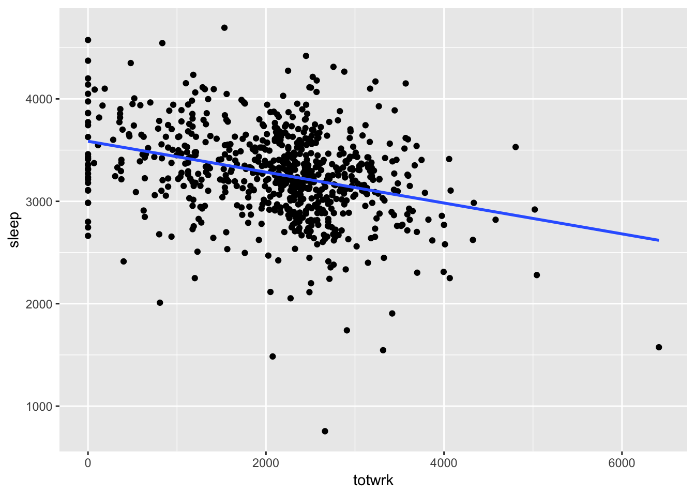
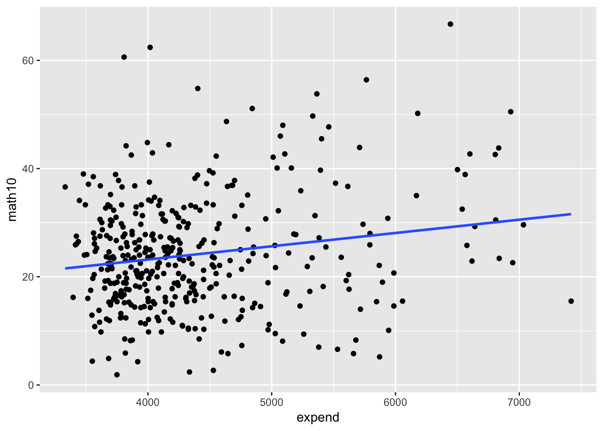
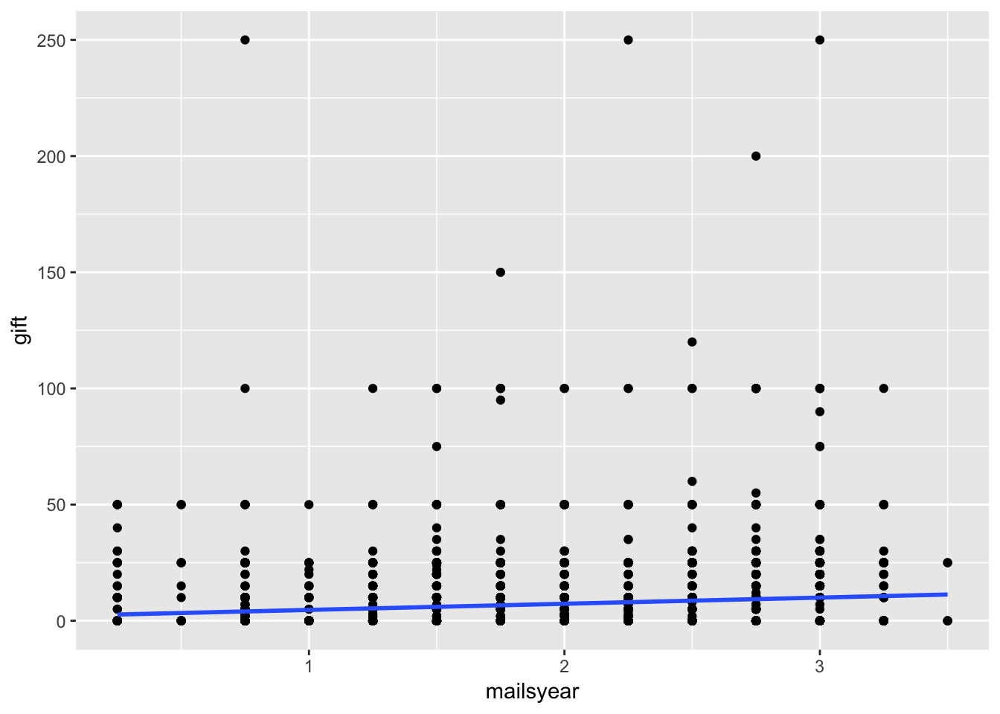
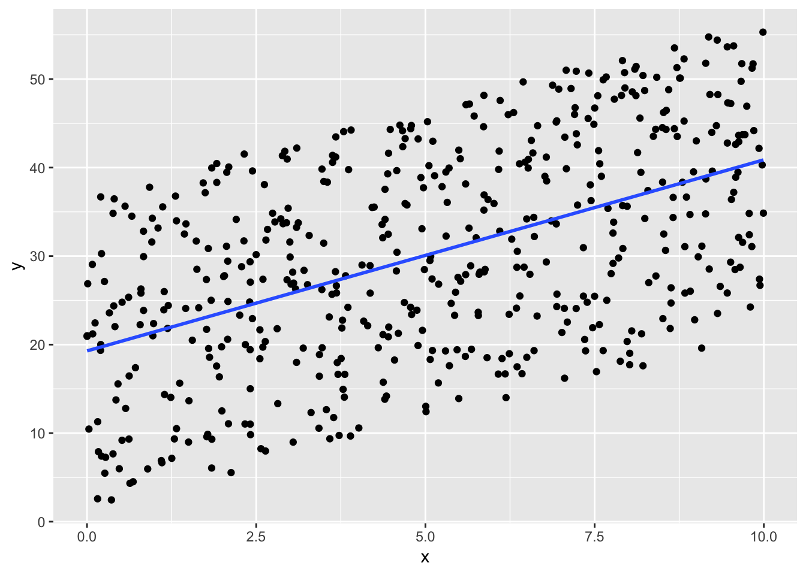
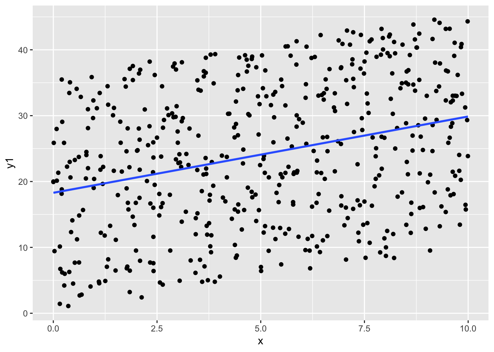
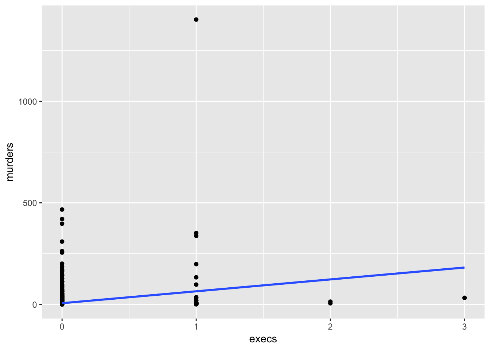
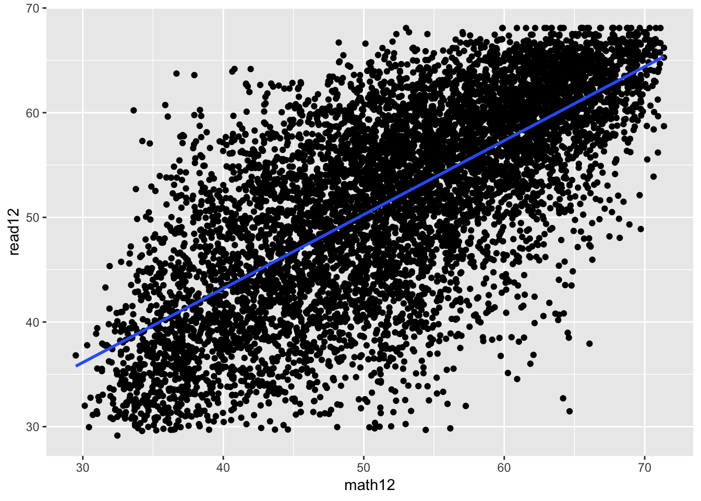

# The simple regression Model

## C1-K401K

The data in 401K are a subset of data analyzed by Papke (1995) to study the relationship between participation in a 401(k) pension plan and the generosity of the plan. The variable prate is the percentage of eligible workers with an active account; this is the variable we would like to explain. The measure of generosity is the plan match rate, mrate. This variable gives the average amount the firm contributes to each worker’s plan for each $1 contribution by the worker. For example, if mrate 5 0.50, then a $1 contribution by the worker is matched by a 50¢ contribution by the firm.

A data.frame with 1534 observations on 8 variables:

- prate: participation rate, percent
- mrate: 401k plan match rate
- totpart: total 401k participants
- totelg: total eligible for 401k plan
- age: age of 401k plan
- totemp: total number of firm employees
- sole: = 1 if 401k is firm’s sole plan
- ltotemp: log of totemp


(i) Find the average participation rate (`prate`) and the average match rate (`mrate`) in the sample of plans.

Avg prate : 87.3629075

Avg mrate 0.7315124

(ii) Now, estimate the simple regression equation

$$\widehat{prate} =  \widehat{\beta}_0 + \widehat{\beta}_1 * mrate$$
and report the results along with the sample size and R-squared.


```
## 
## Call:
## lm(formula = prate ~ mrate, data = k401k)
## 
## Residuals:
##     Min      1Q  Median      3Q     Max 
## -82.303  -8.184   5.178  12.712  16.807 
## 
## Coefficients:
##             Estimate Std. Error t value Pr(>|t|)    
## (Intercept)  83.0755     0.5633  147.48   <2e-16 ***
## mrate         5.8611     0.5270   11.12   <2e-16 ***
## ---
## Signif. codes:  0 '***' 0.001 '**' 0.01 '*' 0.05 '.' 0.1 ' ' 1
## 
## Residual standard error: 16.09 on 1532 degrees of freedom
## Multiple R-squared:  0.0747,	Adjusted R-squared:  0.0741 
## F-statistic: 123.7 on 1 and 1532 DF,  p-value: < 2.2e-16
```


Sample size is 1534. $R^{2}$ value is 0.0747. Adjusted $R^{2}$ value is 0.0741.

(iii) Interpret the intercept in your equation. Interpret the coefficient on mrate.

An increase in `mrate` is associated with a 5.86 increase in the average `prate` and this effect is  `is statistically significant at 1%`.

The intercept implies that, even if `mrate` = 0, the predicted participation rate is 83.1 percent.  The coefficient on `mrate` implies that a one-dollar increase in the match rate – a fairly large increase – is estimated to increase `prate` by 5.86 percentage points.  This assumes, of course, that this change `prate` is possible (if, say, prate is already at 98, this interpretation makes no sense).

(iv) Find the predicted `prate` when `mrate` 3.5. Is this a reasonable prediction? Explain what is happening here.


```
## $fit
##        1 
## 103.5892 
## 
## $se.fit
## [1] 1.515723
## 
## $df
## [1] 1532
## 
## $residual.scale
## [1] 16.08528
```

```
## [1] 103.5892
```

This amount is impossible, as we can have at most a 100 percent participation rate.  This illustrates that, especially when dependent variables are bounded, a simple regression model can give strange predictions for extreme values of the independent variable.  In the sample of 1,534 firms, only 34 have mrate = 3.5.

(v) How much of the variation in `prate` is explained by `mrate`? Is this a lot in your opinion?

The Adjusted $R^{2}$ value is 0.0741. This tells us that 7.41% of the variation in percentage of eligible workers with an active account, as quantified by `prate`, is explained by `mrate`.

`mrate` explains about 7.5% of the variation in `prate`.  This is not much, and suggests that many other factors influence 401(k) plan participation rates.

## C2-CEOSAL2

The data set in CEOSAL2 contains information on chief executive officers for U.S. corporations. The variable salary is annual compensation, in thousands of dollars, and ceoten is prior number of years as company CEO.

A data.frame with 177 observations on 15 variables:

- salary: 1990 compensation, $1000s
- age: in years
- college: =1 if attended college
- grad: =1 if attended graduate school
- comten: years with company
- ceoten: years as ceo with company
- sales: 1990 firm sales, millions
- profits: 1990 profits, millions
- mktval: market value, end 1990, mills.
- lsalary: log(salary)
- lsales: log(sales)
- lmktval: log(mktval)
- comtensq: comten^2
- ceotensq: ceoten^2
- profmarg: profits as percent of sales


(i) Find the average salary and the average tenure in the sample.

* Average salary (1990 compensation, $1000s)


```
## [1] 865.8644
```

* Average salary (log)


```
## [1] 6.582848
```

* Average tenure


```
## [1] 7.954802
```

(ii) How many CEOs are in their first year as CEO (that is, ceoten 5 0)? What is the longest tenure as a CEO?

* Number of CEOs in their first year as CEO


```
## # A tibble: 1 x 1
##       n
##   <int>
## 1     5
```

* Longest tenure as a CEO


```
## [1] 37
```

(iii) Estimate the simple regression model $$log(salary) = \widehat{\beta}_0 + \widehat{\beta}_1 * ceoten + u$$
and report your results in the usual form. What is the (approximate) predicted percentage increase in salary given one more year as a CEO?

Sample size is 177.


```
## 
## Call:
## lm(formula = lsalary ~ ceoten, data = ceosal2)
## 
## Residuals:
##      Min       1Q   Median       3Q      Max 
## -2.15314 -0.38319 -0.02251  0.44439  1.94337 
## 
## Coefficients:
##             Estimate Std. Error t value Pr(>|t|)    
## (Intercept) 6.505498   0.067991  95.682   <2e-16 ***
## ceoten      0.009724   0.006364   1.528    0.128    
## ---
## Signif. codes:  0 '***' 0.001 '**' 0.01 '*' 0.05 '.' 0.1 ' ' 1
## 
## Residual standard error: 0.6038 on 175 degrees of freedom
## Multiple R-squared:  0.01316,	Adjusted R-squared:  0.007523 
## F-statistic: 2.334 on 1 and 175 DF,  p-value: 0.1284
```


<!-- The intercept implies that the estimated amount of sleep per week for someone who does not work is 3,586.4 minutes, or about 59.77 hours.  This comes to about 8.5 hours per night. -->

## C3-SLEEP75

Use the data in SLEEP75 from Biddle and Hamermesh (1990) to study whether there is a tradeoff between the time spent sleeping per week and the time spent in paid work. We could use either variable as the dependent variable. For concreteness, estimate the model
$$sleep = \widehat{\beta}_0 + \widehat{\beta}_1 * totwrk + u$$
where sleep is minutes spent sleeping at night per week and totwrk is total minutes worked during the week.

A data.frame with 706 observations on 34 variables:

- age: in years
- black: =1 if black
- case: identifier
- clerical: =1 if clerical worker
- construc: =1 if construction worker
- educ: years of schooling
- earns74: total earnings, 1974
- gdhlth: =1 if in good or excel. health
- inlf: =1 if in labor force
- leis1: sleep - totwrk
- leis2: slpnaps - totwrk
- leis3: rlxall - totwrk
- smsa: =1 if live in smsa
- lhrwage: log hourly wage
- lothinc: log othinc, unless othinc < 0
- male: =1 if male
- marr: =1 if married
- prot: =1 if Protestant
- rlxall: slpnaps + personal activs
- selfe: =1 if self employed
- sleep: mins sleep at night, per wk
- slpnaps: minutes sleep, inc. naps
- south: =1 if live in south
- spsepay: spousal wage income
- spwrk75: =1 if spouse works
- totwrk: mins worked per week
- union: =1 if belong to union
- worknrm: mins work main job
- workscnd: mins work second job
- exper: age - educ - 6
- yngkid: =1 if children < 3 present
- yrsmarr: years married
- hrwage: hourly wage
- agesq: age^2


```
## 
## Call:
## lm(formula = sleep ~ totwrk, data = sleep75)
## 
## Residuals:
##      Min       1Q   Median       3Q      Max 
## -2429.94  -240.25     4.91   250.53  1339.72 
## 
## Coefficients:
##               Estimate Std. Error t value Pr(>|t|)    
## (Intercept) 3586.37695   38.91243  92.165   <2e-16 ***
## totwrk        -0.15075    0.01674  -9.005   <2e-16 ***
## ---
## Signif. codes:  0 '***' 0.001 '**' 0.01 '*' 0.05 '.' 0.1 ' ' 1
## 
## Residual standard error: 421.1 on 704 degrees of freedom
## Multiple R-squared:  0.1033,	Adjusted R-squared:  0.102 
## F-statistic: 81.09 on 1 and 704 DF,  p-value: < 2.2e-16
```

(i) Report your results in equation form along with the number of observations and $R^{2}$. What does the intercept in this equation mean?

$$sleep = 3586.4 - 0.151 * totwrk$$

Sample size is 706.  $R^{2}$ value is 0.1033. Adjusted $R^{2}$ value is 0.102.

The intercept implies that the estimated amount of sleep per week (`sleep`) for someone who does not work (`totwrk` = 0) is 3590 minutes, or about 59.8 hours.  This comes to about 8.5 hours per night.

(ii) If totwrk increases by 2 hours, by how much is sleep estimated to fall? Do you find this to be a large effect?

If someone works two more hours per week then totwrk = 120 (totwrk is measured in minutes not hours).  The amount of sleep would decrease by -0.151(120) = -18.1 minutes.  


```
## $fit
##        1 
## 3568.287 
## 
## $se.fit
## [1] 37.08682
## 
## $df
## [1] 704
## 
## $residual.scale
## [1] 421.1357
```


```
## [1] -18.0895
```



## C4-WAGE2

Use the data in WAGE2 to estimate a simple regression explaining monthly salary (wage) in terms of IQ score (IQ).

A data.frame with 935 observations on 17 variables:

- wage: monthly earnings
- hours: average weekly hours
- IQ: IQ score
- KWW: knowledge of world work score
- educ: years of education
- exper: years of work experience
- tenure: years with current employer
- age: age in years
- married: =1 if married
- black: =1 if black
- south: =1 if live in south
- urban: =1 if live in SMSA
- sibs: number of siblings
- brthord: birth order
- meduc: mother’s education
- feduc: father’s education
- lwage: natural log of wage


(i) Find the average salary and average IQ in the sample. What is the sample standard deviation of IQ? (IQ scores are standardized so that the average in the population is 100 with a standard deviation equal to 15.)


```
## [1] 957.9455
```


```
## [1] 101.2824
```


```
## [1] 15.05264
```

(ii) Estimate a simple regression model where a one-point increase in IQ changes wage by a constant dollar amount. Use this model to find the predicted increase in wage for an increase in IQ of 15 points. Does IQ explain most of the variation in wage?


```
## 
## Call:
## lm(formula = wage ~ IQ, data = wage2)
## 
## Residuals:
##    Min     1Q Median     3Q    Max 
## -898.7 -256.5  -47.3  201.1 2072.6 
## 
## Coefficients:
##             Estimate Std. Error t value Pr(>|t|)    
## (Intercept) 116.9916    85.6415   1.366    0.172    
## IQ            8.3031     0.8364   9.927   <2e-16 ***
## ---
## Signif. codes:  0 '***' 0.001 '**' 0.01 '*' 0.05 '.' 0.1 ' ' 1
## 
## Residual standard error: 384.8 on 933 degrees of freedom
## Multiple R-squared:  0.09554,	Adjusted R-squared:  0.09457 
## F-statistic: 98.55 on 1 and 933 DF,  p-value: < 2.2e-16
```

Sample size is 935.  $R^{2}$ value is 0.0955. Adjusted $R^{2}$ value is 0.0946.


Estimate a simple regression model where a one-point increase in IQ changes wage by a constant dollar amount. Use this model to find the predicted increase in wage for an increase in IQ of 15 points. Does IQ explain most of the variation in wage?


```
## $fit
##        1 
## 241.5375 
## 
## $se.fit
## [1] 73.25496
## 
## $df
## [1] 933
## 
## $residual.scale
## [1] 384.7667
```

(iii) Now, estimate a model where each one-point increase in IQ has the same percent- age effect on wage. If IQ increases by 15 points, what is the approximate percent- age increase in predicted wage?


## C5-RDCHEM

For the population of firms in the chemical industry, let rd denote annual expenditures on research and development, and let sales denote annual sales (both are in millions of dollars).

A data.frame with 32 observations on 8 variables:

- rd: R&D spending, millions
- sales: firm sales, millions
- profits: profits, millions
- rdintens: rd as percent of sales
- profmarg: profits as percent of sales
- salessq: sales^2
- lsales: log(sales)
- lrd: log(rd)


(i) Write down a model (not an estimated equation) that implies a constant elasticity between rd and sales. Which parameter is the elasticity?

The constant elasticity model is a log-log model: $$ log(rd) = \beta_0 + \beta_1 * log(sales) $$ where $\beta_1$ is the elasticity of `rd` with respect to `sales`.


```
## 
## Call:
## lm(formula = lrd ~ lsales, data = rdchem)
## 
## Residuals:
##      Min       1Q   Median       3Q      Max 
## -0.90406 -0.40086 -0.02178  0.40562  1.10439 
## 
## Coefficients:
##             Estimate Std. Error t value Pr(>|t|)    
## (Intercept) -4.10472    0.45277  -9.066 4.27e-10 ***
## lsales       1.07573    0.06183  17.399  < 2e-16 ***
## ---
## Signif. codes:  0 '***' 0.001 '**' 0.01 '*' 0.05 '.' 0.1 ' ' 1
## 
## Residual standard error: 0.5294 on 30 degrees of freedom
## Multiple R-squared:  0.9098,	Adjusted R-squared:  0.9068 
## F-statistic: 302.7 on 1 and 30 DF,  p-value: < 2.2e-16
```

(ii) Now, estimate the model using the data in RDCHEM.RAW. Write out the estimated equation in the usual form. What is the estimated elasticity of rd with respect to sales? Explain in words what this elasticity means.


```
## 
## Call:
## lm(formula = lrd ~ lsales, data = rdchem)
## 
## Residuals:
##      Min       1Q   Median       3Q      Max 
## -0.90406 -0.40086 -0.02178  0.40562  1.10439 
## 
## Coefficients:
##             Estimate Std. Error t value Pr(>|t|)    
## (Intercept) -4.10472    0.45277  -9.066 4.27e-10 ***
## lsales       1.07573    0.06183  17.399  < 2e-16 ***
## ---
## Signif. codes:  0 '***' 0.001 '**' 0.01 '*' 0.05 '.' 0.1 ' ' 1
## 
## Residual standard error: 0.5294 on 30 degrees of freedom
## Multiple R-squared:  0.9098,	Adjusted R-squared:  0.9068 
## F-statistic: 302.7 on 1 and 30 DF,  p-value: < 2.2e-16
```

The estimated equation is: $$ log(rd) = -4.105 + 1.076 * log(sales) $$

The estimated elasticity of `rd` with respect to sales is 1.08, which is just above one.  A one percent increase in `sales` is estimated to increase `rd` by about 1.1%.

## C6-MEAP93

We used the data in MEAP93 for Example 2.12. Now we want to explore the relationship between the math pass rate (math10) and spending per student (expend).

A data.frame with 408 observations on 17 variables:

- lnchprg: perc of studs in sch lnch prog
- enroll: school enrollment
- staff: staff per 1000 students
- expend: expend. per stud, $
- salary: avg. teacher salary, $
- benefits: avg. teacher benefits, $
- droprate: school dropout rate, perc
- gradrate: school graduation rate, perc
- math10: perc studs passing MEAP math
- sci11: perc studs passing MEAP science
- totcomp: salary + benefits
- ltotcomp: log(totcomp)
- lexpend: log of expend
- lenroll: log(enroll)
- lstaff: log(staff)
- bensal: benefits/salary
- lsalary: log(salary)


(i) Do you think each additional dollar spent has the same effect on the pass rate, or
does a diminishing effect seem more appropriate? Explain.

* Additional dollar spent does not have same effect on the pass rate.  I expect diminishing effect.


```
## 
## Call:
## lm(formula = math10 ~ expend, data = meap93)
## 
## Residuals:
##     Min      1Q  Median      3Q     Max 
## -22.579  -7.175  -0.874   6.299  39.174 
## 
## Coefficients:
##              Estimate Std. Error t value Pr(>|t|)    
## (Intercept) 1.336e+01  2.934e+00   4.553    7e-06 ***
## expend      2.456e-03  6.601e-04   3.720 0.000227 ***
## ---
## Signif. codes:  0 '***' 0.001 '**' 0.01 '*' 0.05 '.' 0.1 ' ' 1
## 
## Residual standard error: 10.33 on 406 degrees of freedom
## Multiple R-squared:  0.03296,	Adjusted R-squared:  0.03058 
## F-statistic: 13.84 on 1 and 406 DF,  p-value: 0.0002273
```



(ii) In the population model $$math10 + \widehat{\beta}_0 + \widehat{\beta}_1 log(expend ) + u$$
argue that b1/10 is the percentage point change in math10 given a 10% increase in expend.


$$\beta_1 /10$$ is the percentage point change in `math10` given a 10% increase in `expend`.


```
## 
## Call:
## lm(formula = math10 ~ lexpend, data = meap93)
## 
## Residuals:
##     Min      1Q  Median      3Q     Max 
## -22.343  -7.100  -0.914   6.148  39.093 
## 
## Coefficients:
##             Estimate Std. Error t value Pr(>|t|)    
## (Intercept)  -69.341     26.530  -2.614 0.009290 ** 
## lexpend       11.164      3.169   3.523 0.000475 ***
## ---
## Signif. codes:  0 '***' 0.001 '**' 0.01 '*' 0.05 '.' 0.1 ' ' 1
## 
## Residual standard error: 10.35 on 406 degrees of freedom
## Multiple R-squared:  0.02966,	Adjusted R-squared:  0.02727 
## F-statistic: 12.41 on 1 and 406 DF,  p-value: 0.0004752
```

(iii) Use the data in MEAP93 to estimate the model from part (ii). Report the estimated equation in the usual way, including the sample size and R-squared.

A 10% increase in `expendidure` is associated with a 11.2 increase in the average perc studs passing MEAP math and this effect is `is statistically significant at 1%`.


(iv) How big is the estimated spending effect? Namely, if spending increases by 10%, what is the estimated percentage point increase in math10?

(v) One might worry that regression analysis can produce fitted values for math10 that are greater than 100. Why is this not much of a worry in this data set?

## C7-CHARITU

Use the data in CHARITY [obtained from Franses and Paap (2001)] to answer the following questions:

A data.frame with 4268 observations on 8 variables:

- respond: =1 if responded with gift
- gift: amount of gift, Dutch guilders
- resplast: =1 if responded to most recent mailing
- weekslast: number of weeks since last response
- propresp: response rate to mailings
- mailsyear: number of mailings per year
- giftlast: amount of most recent gift
- avggift: average of past gifts


(i) What is the average gift in the sample of 4,268 people (in Dutch guilders)? What percentage of people gave no gift?

* Average gift (Dutch guilders) and % of people that gave no gift


```
## [1] 7.44447
```

```
## [1] 0.6000469
```

The average gift is about 7.4444705 Dutch guilders. Out of 4268 respondents, 2561 did not give a gift, or about 60 percent.

(ii) What is the average mailings per year? What are the minimum and maximum values?

* Average, min and max mailing per year


```
## [1] 2.049555
```

```
## [1] 0.25
```

```
## [1] 3.5
```

The average mailings per year is about 2.05. The minimum value is 0.25 (which presumably means that someone has been on the mailing list for at least four years) and the maximum value is 3.5.

(iii) Estimate the model $$gift = \widehat{\beta}_0 + \widehat{\beta}_1 * mailsyear + u$$
by OLS and report the results in the usual way, including the sample size and R-squared.


```
## 
## Call:
## lm(formula = gift ~ mailsyear, data = charity)
## 
## Residuals:
##     Min      1Q  Median      3Q     Max 
## -11.287  -7.976  -5.976   2.687 245.999 
## 
## Coefficients:
##             Estimate Std. Error t value Pr(>|t|)    
## (Intercept)   2.0141     0.7395   2.724  0.00648 ** 
## mailsyear     2.6495     0.3431   7.723  1.4e-14 ***
## ---
## Signif. codes:  0 '***' 0.001 '**' 0.01 '*' 0.05 '.' 0.1 ' ' 1
## 
## Residual standard error: 14.96 on 4266 degrees of freedom
## Multiple R-squared:  0.01379,	Adjusted R-squared:  0.01356 
## F-statistic: 59.65 on 1 and 4266 DF,  p-value: 1.404e-14
```

Sample size is 4268.  $R^{2}$ value is 0.0138. Adjusted $R^{2}$ value is 0.0136.



(iv) Interpret the slope coefficient. If each mailing costs one guilder, is the charity expected to make a net gain on each mailing? Does this mean the charity makes a net gain on every mailing? Explain.

The estimated equation is  $$gift = 2.0141 + 2.6495 * mailsyear$$

The slope coefficient means that each mailing per year is associated with an estimated 2.65 additional guilders, on average. Therefore, if each mailing costs one guilder, the expected profit from each mailing is estimated to be 2.65 guilders. This is only the average, however. 

<!-- Some mailings generate no contributions, or a contribution less than the mailing cost; other mailings generated much more than the mailing cost. -->

(v) What is the smallest predicted charitable contribution in the sample? Using this simple regression analysis, can you ever predict zero for gift?

Min gift where some people have received 0.25 mailings: 0


```
## $fit
##       1 
## 2.01408 
## 
## $se.fit
## [1] 0.7394696
## 
## $df
## [1] 4266
## 
## $residual.scale
## [1] 14.9601
```


The smallest mailsyear in the sample is 0.25. The smallest predicted value of gifts is 2.01 + 2.65 (.25) = 2.68. With this estimated equation, we never predict zero charitable gifts.

## C8

To complete this exercise you need a software package that allows you to generate data from the uniform and normal distributions.

(i) Start by generating 500 observations xi – the explanatory variable – from the uniform distribution with range [0,10]. (Most statistical packages have a command for the Uniform[0,1] distribution; just multiply those observations by 10.) What are the sample mean and sample standard deviation of the xi?

The expected mean is about 5.


```
## [1] 4.990447
```

```
## [1] 2.97186
```

(ii) Randomly generate 500 errors, ui, from the Normal[0,36] distribution. (If you generate a Normal[0,1], as is commonly available, simply multiply the outcomes by six.) Is the sample average of the ui exactly zero? Why or why not? What is the sample standard deviation of the ui?

The expected mean is about 18.


```
## [1] 17.79883
```

```
## [1] 10.55366
```


(iii) Now generate the yi as $$y_i = 1 + 2x_i + u_i = \widehat{\beta}_0 + \beta x_i + ui$$;
that is, the population intercept is one and the population slope is two. Use the data to run the regression of yi on xi. What are your estimates of the intercept and slope? Are they equal to the population values in the above equation? Explain.


(iv) Obtain the OLS residuals, uˆi, and verify that equation (2.60) hold (subject to rounding error).

(v) Compute the same quantities in equation (2.60) but use the errors ui in place of the residuals. Now what do you conclude?

(vi) Repeat parts (i), (ii), and (iii) with a new sample of data, starting with generating the xi. Now what do you obtain for bˆ0 and bˆ1? Why are these different from what you obtained in part (iii)?


```
## 
## Call:
## lm(formula = y ~ x, data = df)
## 
## Residuals:
##      Min       1Q   Median       3Q      Max 
## -17.9621  -9.3821  -0.4003   9.1537  18.0570 
## 
## Coefficients:
##             Estimate Std. Error t value Pr(>|t|)    
## (Intercept)  19.4545     0.9234   21.07   <2e-16 ***
## x             1.8686     0.1590   11.75   <2e-16 ***
## ---
## Signif. codes:  0 '***' 0.001 '**' 0.01 '*' 0.05 '.' 0.1 ' ' 1
## 
## Residual standard error: 10.56 on 498 degrees of freedom
## Multiple R-squared:  0.2171,	Adjusted R-squared:  0.2155 
## F-statistic: 138.1 on 1 and 498 DF,  p-value: < 2.2e-16
```



```
## 
## Call:
## lm(formula = y1 ~ x, data = df)
## 
## Residuals:
##      Min       1Q   Median       3Q      Max 
## -17.9621  -9.3821  -0.4003   9.1537  18.0570 
## 
## Coefficients:
##             Estimate Std. Error t value Pr(>|t|)    
## (Intercept)  18.4545     0.9234  19.985  < 2e-16 ***
## x             0.8686     0.1590   5.462 7.44e-08 ***
## ---
## Signif. codes:  0 '***' 0.001 '**' 0.01 '*' 0.05 '.' 0.1 ' ' 1
## 
## Residual standard error: 10.56 on 498 degrees of freedom
## Multiple R-squared:  0.05652,	Adjusted R-squared:  0.05463 
## F-statistic: 29.84 on 1 and 498 DF,  p-value: 7.439e-08
```




## C9-countymurders

A data.frame with 37349 observations on 20 variables:

- arrests: # of murder arrests
- countyid: county identifier: 1000*statefips + countyfips
- density: population density; per square mile
- popul: county population
- perc1019: percent pop. age 10-19
- perc2029: percent pop. age 20-29
- percblack: percent population black
- percmale: percent population male
- rpcincmaint: real per capita income maintenance
- rpcpersinc: real per capita personal income
- rpcunemins: real per capita unem insurance payments
- year: 1980-1996
- murders: # of murders
- murdrate: murders per 10,000 people
- arrestrate: murder arrests per 10,000
- statefips: state FIPS code
- countyfips: county FIPS code
- execs: # of executions
- lpopul: log(popul)
- execrate: executions per 10,000


```
## # A tibble: 1 x 1
##       n
##   <int>
## 1  1051
```


```
## # A tibble: 1 x 1
##       n
##   <int>
## 1    31
```


```
##   max_execs
## 1         3
```


```
## 
## Call:
## lm(formula = murders ~ execs, data = countymurders %>% filter(year == 
##     1996))
## 
## Residuals:
##     Min      1Q  Median      3Q     Max 
## -149.12   -5.46   -4.46   -2.46 1338.99 
## 
## Coefficients:
##             Estimate Std. Error t value Pr(>|t|)    
## (Intercept)   5.4572     0.8348   6.537 7.79e-11 ***
## execs        58.5555     5.8333  10.038  < 2e-16 ***
## ---
## Signif. codes:  0 '***' 0.001 '**' 0.01 '*' 0.05 '.' 0.1 ' ' 1
## 
## Residual standard error: 38.89 on 2195 degrees of freedom
## Multiple R-squared:  0.04389,	Adjusted R-squared:  0.04346 
## F-statistic: 100.8 on 1 and 2195 DF,  p-value: < 2.2e-16
```




```
## $fit
##        1 
## 5.457241 
## 
## $se.fit
## [1] 0.834838
## 
## $df
## [1] 2195
## 
## $residual.scale
## [1] 38.88748
```

```
## [1] 5.457241
```

## C10-CATHOLIC

A data.frame with 7430 observations on 13 variables:

- id: person identifier
- read12: reading standardized score
- math12: mathematics standardized score
- female: =1 if female
- asian: =1 if Asian
- hispan: =1 if Hispanic
- black: =1 if black
- motheduc: mother’s years of education
- fatheduc: father’s years of education
- lfaminc: log of family income
- hsgrad: =1 if graduated from high school by 1994
- cathhs: =1 if attended Catholic HS
- parcath: =1 if a parent reports being Catholic


Sample size


```
## # A tibble: 1 x 1
##       n
##   <int>
## 1  7430
```

Means and standard deviation for math12 and read12


```
##   math12_mean math12_sd read12_mean read12_sd
## 1    52.13362  9.459117     51.7724  9.407761
```


```
## 
## Call:
## lm(formula = math12 ~ read12, data = catholic)
## 
## Residuals:
##      Min       1Q   Median       3Q      Max 
## -24.5477  -4.5934   0.1838   4.6984  27.0182 
## 
## Coefficients:
##             Estimate Std. Error t value Pr(>|t|)    
## (Intercept) 15.15304    0.43204   35.07   <2e-16 ***
## read12       0.71429    0.00821   87.00   <2e-16 ***
## ---
## Signif. codes:  0 '***' 0.001 '**' 0.01 '*' 0.05 '.' 0.1 ' ' 1
## 
## Residual standard error: 6.658 on 7428 degrees of freedom
## Multiple R-squared:  0.5047,	Adjusted R-squared:  0.5046 
## F-statistic:  7569 on 1 and 7428 DF,  p-value: < 2.2e-16
```


An increase in `reading standardized score` is associated with a 0.714 increase in the average `mathematics standardized score` and this effect is  `is statistically significant at 1%`.


```
## 
## Call:
## lm(formula = read12 ~ math12, data = catholic)
## 
## Residuals:
##      Min       1Q   Median       3Q      Max 
## -29.1459  -4.2021   0.4885   4.4920  22.8935 
## 
## Coefficients:
##              Estimate Std. Error t value Pr(>|t|)    
## (Intercept) 14.937062   0.430318   34.71   <2e-16 ***
## math12       0.706556   0.008122   87.00   <2e-16 ***
## ---
## Signif. codes:  0 '***' 0.001 '**' 0.01 '*' 0.05 '.' 0.1 ' ' 1
## 
## Residual standard error: 6.621 on 7428 degrees of freedom
## Multiple R-squared:  0.5047,	Adjusted R-squared:  0.5046 
## F-statistic:  7569 on 1 and 7428 DF,  p-value: < 2.2e-16
```



