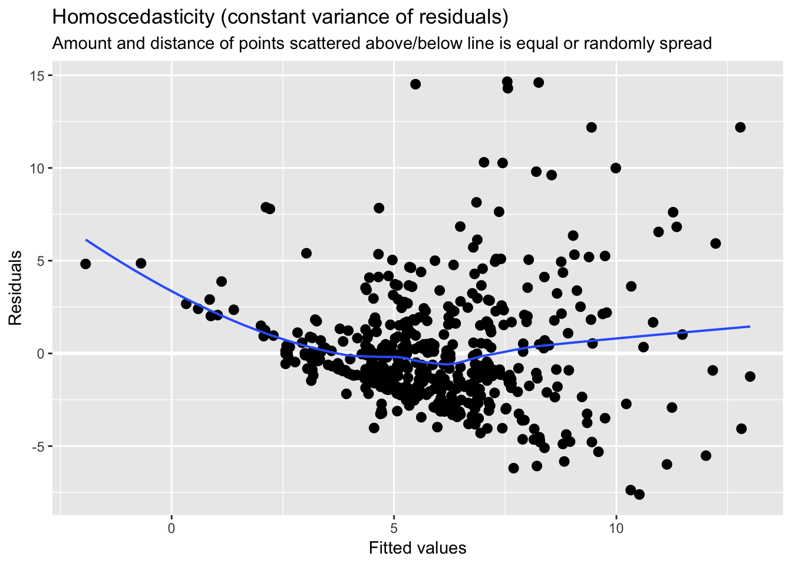
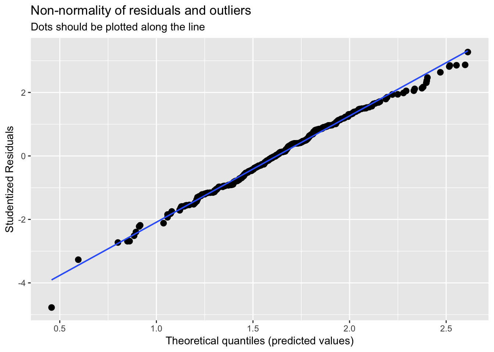
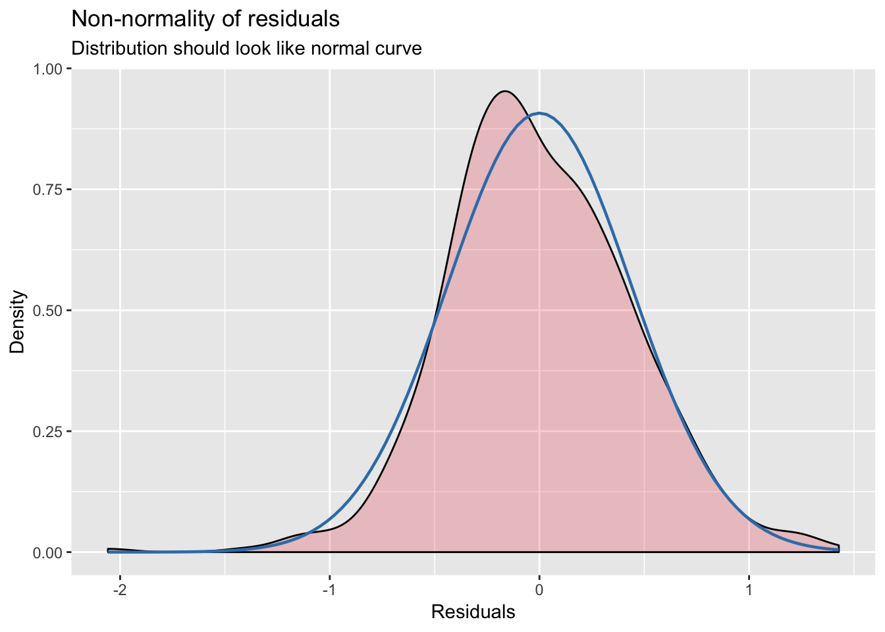
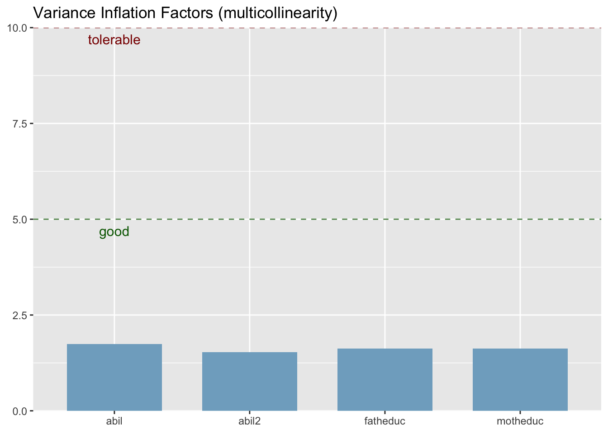
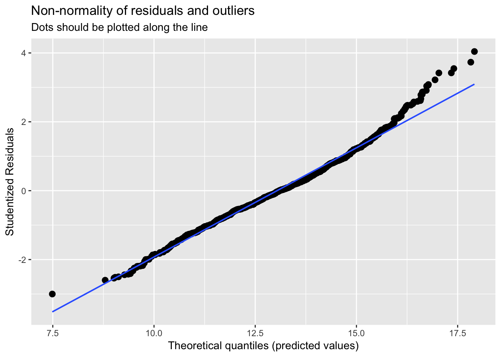
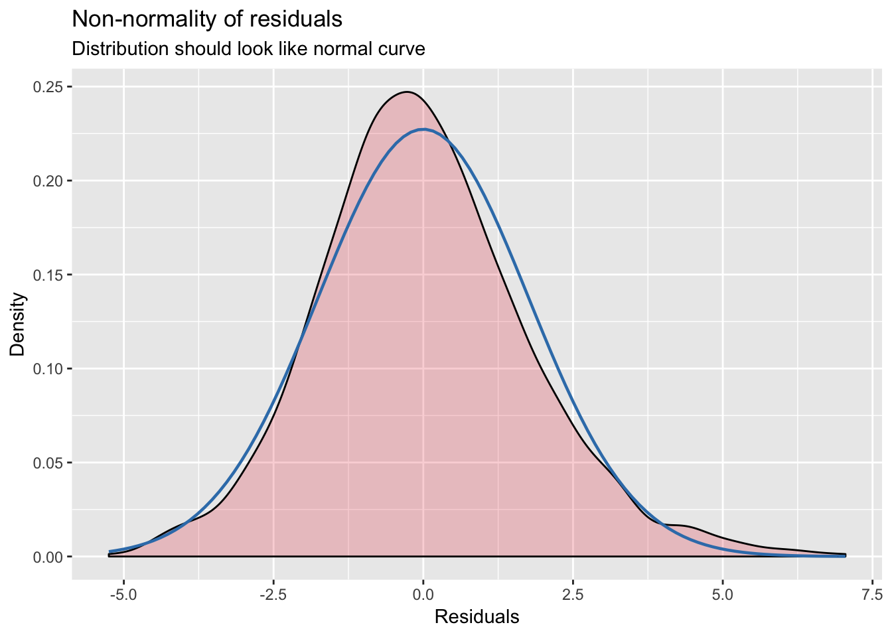
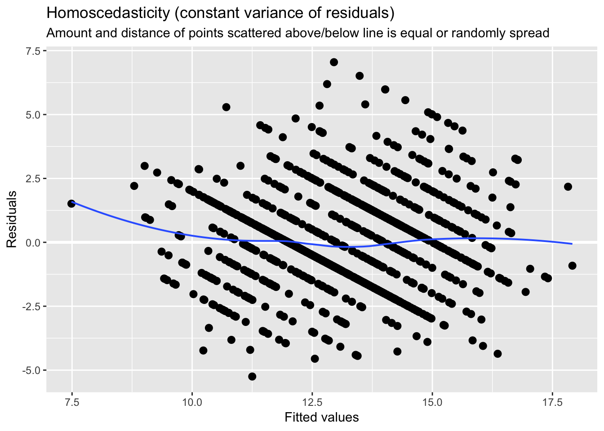

# Multiple regression analysis: OLS asymptotics

## Problem 3

The data set SMOKE contains information on smoking behavior and other variables for a random sample of single adults from the United States. The variable cigs is the (average) number of cigarettes smoked per day. Do you think cigs has a normal distribution in the U.S. adult population? Explain.


## C1

Use the data in WAGE1.RAW for this exercise.
(i) Estimate the equation

$$wage =  \beta_0 + \beta_1 * educ + \beta_2 * exper + \beta_3 * tenure + u$$


Save the residuals and plot a histogram.


```
## 
## Call:
## lm(formula = wage ~ educ + exper + tenure, data = wage1)
## 
## Residuals:
##     Min      1Q  Median      3Q     Max 
## -7.6068 -1.7747 -0.6279  1.1969 14.6536 
## 
## Coefficients:
##             Estimate Std. Error t value Pr(>|t|)    
## (Intercept) -2.87273    0.72896  -3.941 9.22e-05 ***
## educ         0.59897    0.05128  11.679  < 2e-16 ***
## exper        0.02234    0.01206   1.853   0.0645 .  
## tenure       0.16927    0.02164   7.820 2.93e-14 ***
## ---
## Signif. codes:  0 '***' 0.001 '**' 0.01 '*' 0.05 '.' 0.1 ' ' 1
## 
## Residual standard error: 3.084 on 522 degrees of freedom
## Multiple R-squared:  0.3064,	Adjusted R-squared:  0.3024 
## F-statistic: 76.87 on 3 and 522 DF,  p-value: < 2.2e-16
```

```
## [[1]]
```


```
## 
## [[2]]
```


```
## 
## [[3]]
```


```
## 
## [[4]]
```



(ii) Repeat part (i), but with log(wage) as the dependent variable.


```
## 
## Call:
## lm(formula = lwage ~ educ + exper + tenure, data = wage1)
## 
## Residuals:
##      Min       1Q   Median       3Q      Max 
## -2.05802 -0.29645 -0.03265  0.28788  1.42809 
## 
## Coefficients:
##             Estimate Std. Error t value Pr(>|t|)    
## (Intercept) 0.284360   0.104190   2.729  0.00656 ** 
## educ        0.092029   0.007330  12.555  < 2e-16 ***
## exper       0.004121   0.001723   2.391  0.01714 *  
## tenure      0.022067   0.003094   7.133 3.29e-12 ***
## ---
## Signif. codes:  0 '***' 0.001 '**' 0.01 '*' 0.05 '.' 0.1 ' ' 1
## 
## Residual standard error: 0.4409 on 522 degrees of freedom
## Multiple R-squared:  0.316,	Adjusted R-squared:  0.3121 
## F-statistic: 80.39 on 3 and 522 DF,  p-value: < 2.2e-16
```

```
## [[1]]
```


```
## 
## [[2]]
```



```
## 
## [[3]]
```



```
## 
## [[4]]
```


(iii) Would you say that Assumption MLR.6 is closer to being satisfied for the level-level model or the log-level model?

Assumption MLR.6 is closer to being satisfied for the log-level model.

## C2

Use the data in GPA2 for this exercise.


(i) Using all 4,137 observations, estimate the equation 

$$colgpa =  \beta_0 + \beta_1 * hsperc + \beta_2 * sat + u$$


and report the results in standard form.


```
## 
## Call:
## lm(formula = colgpa ~ hsperc + sat, data = gpa2)
## 
## Residuals:
##     Min      1Q  Median      3Q     Max 
## -2.6007 -0.3581  0.0329  0.3963  1.7599 
## 
## Coefficients:
##               Estimate Std. Error t value Pr(>|t|)    
## (Intercept)  1.392e+00  7.154e-02   19.45   <2e-16 ***
## hsperc      -1.352e-02  5.495e-04  -24.60   <2e-16 ***
## sat          1.476e-03  6.531e-05   22.60   <2e-16 ***
## ---
## Signif. codes:  0 '***' 0.001 '**' 0.01 '*' 0.05 '.' 0.1 ' ' 1
## 
## Residual standard error: 0.5615 on 4134 degrees of freedom
## Multiple R-squared:  0.2734,	Adjusted R-squared:  0.2731 
## F-statistic: 777.9 on 2 and 4134 DF,  p-value: < 2.2e-16
```

(ii) Reestimate the equation in part (i), using the first 2,070 observations.


```
## 
## Call:
## lm(formula = colgpa ~ hsperc + sat, data = gpa2[1:2070, ])
## 
## Residuals:
##      Min       1Q   Median       3Q      Max 
## -2.28027 -0.34910  0.04051  0.38046  1.69464 
## 
## Coefficients:
##               Estimate Std. Error t value Pr(>|t|)    
## (Intercept)  1.436e+00  9.778e-02   14.69   <2e-16 ***
## hsperc      -1.275e-02  7.185e-04  -17.74   <2e-16 ***
## sat          1.468e-03  8.858e-05   16.58   <2e-16 ***
## ---
## Signif. codes:  0 '***' 0.001 '**' 0.01 '*' 0.05 '.' 0.1 ' ' 1
## 
## Residual standard error: 0.5395 on 2067 degrees of freedom
## Multiple R-squared:  0.2827,	Adjusted R-squared:  0.282 
## F-statistic: 407.4 on 2 and 2067 DF,  p-value: < 2.2e-16
```

(iii) Find the ratio of the standard errors on hsperc from parts (i) and (ii). Compare this
with the result from (5.10).

## C3

In equation (4.42) of Chapter 4, using the data set BWGHT, compute the LM statistic for testing whether motheduc and fatheduc are jointly significant. In obtaining the residuals for the restricted model, be sure that the restricted model is estimated using only those observations for which all variables in the unrestricted model are available (see Example 4.9).


```
## 
## Call:
## lm(formula = bwght ~ cigs + parity + faminc + motheduc + fatheduc, 
##     data = bwght)
## 
## Residuals:
##     Min      1Q  Median      3Q     Max 
## -95.796 -11.960   0.643  12.679 150.879 
## 
## Coefficients:
##              Estimate Std. Error t value Pr(>|t|)    
## (Intercept) 114.52433    3.72845  30.716  < 2e-16 ***
## cigs         -0.59594    0.11035  -5.401 8.02e-08 ***
## parity        1.78760    0.65941   2.711  0.00681 ** 
## faminc        0.05604    0.03656   1.533  0.12559    
## motheduc     -0.37045    0.31986  -1.158  0.24702    
## fatheduc      0.47239    0.28264   1.671  0.09492 .  
## ---
## Signif. codes:  0 '***' 0.001 '**' 0.01 '*' 0.05 '.' 0.1 ' ' 1
## 
## Residual standard error: 19.79 on 1185 degrees of freedom
## Multiple R-squared:  0.03875,	Adjusted R-squared:  0.03469 
## F-statistic: 9.553 on 5 and 1185 DF,  p-value: 5.986e-09
```

```
##  [1] faminc   cigtax   cigprice bwght    fatheduc motheduc parity  
##  [8] male     white    cigs     lbwght   bwghtlbs packs    lfaminc 
## <0 rows> (or 0-length row.names)
```


```
## 
## Call:
## lm(formula = bwght ~ cigs + parity + faminc, data = bwght)
## 
## Residuals:
##     Min      1Q  Median      3Q     Max 
## -95.811 -11.552   0.524  12.739 150.848 
## 
## Coefficients:
##              Estimate Std. Error t value Pr(>|t|)    
## (Intercept) 115.46993    1.65590  69.733  < 2e-16 ***
## cigs         -0.59785    0.10877  -5.496 4.74e-08 ***
## parity        1.83227    0.65754   2.787  0.00541 ** 
## faminc        0.06706    0.03239   2.070  0.03865 *  
## ---
## Signif. codes:  0 '***' 0.001 '**' 0.01 '*' 0.05 '.' 0.1 ' ' 1
## 
## Residual standard error: 19.8 on 1187 degrees of freedom
## Multiple R-squared:  0.03642,	Adjusted R-squared:  0.03398 
## F-statistic: 14.95 on 3 and 1187 DF,  p-value: 1.472e-09
```


```
## Analysis of Variance Table
## 
## Model 1: bwght ~ cigs + parity + faminc + motheduc + fatheduc
## Model 2: bwght ~ cigs + parity + faminc
##   Res.Df    RSS Df Sum of Sq      F Pr(>F)
## 1   1185 464041                           
## 2   1187 465167 -2   -1125.7 1.4373  0.238
```

## C5

Consider the analysis in Computer Exercise C11 in Chapter 4 using the data in HTV, where educ is the dependent variable in a regression.

educ 5 0 1 1motheduc 1 2 fatheduc 1 3abil 1 4abil2 1 u


```
## 
## Call:
## lm(formula = educ ~ motheduc + fatheduc + abil + abil2, data = htv)
## 
## Residuals:
##     Min      1Q  Median      3Q     Max 
## -5.2506 -1.1274 -0.1355  1.0223  7.0482 
## 
## Coefficients:
##             Estimate Std. Error t value Pr(>|t|)    
## (Intercept) 8.240226   0.287410  28.671  < 2e-16 ***
## motheduc    0.190126   0.028096   6.767 2.03e-11 ***
## fatheduc    0.108939   0.019601   5.558 3.35e-08 ***
## abil        0.401462   0.030288  13.255  < 2e-16 ***
## abil2       0.050599   0.008304   6.093 1.48e-09 ***
## ---
## Signif. codes:  0 '***' 0.001 '**' 0.01 '*' 0.05 '.' 0.1 ' ' 1
## 
## Residual standard error: 1.758 on 1225 degrees of freedom
## Multiple R-squared:  0.4444,	Adjusted R-squared:  0.4425 
## F-statistic: 244.9 on 4 and 1225 DF,  p-value: < 2.2e-16
```

(i) How many different values are taken on by educ in the sample? Does educ have a
continuous distribution?

There are 15 different values are taken on by educ in the sample.  educ does not have a
continuous distribution.


```
## # A tibble: 15 x 2
##    educ      n
##    <fct> <int>
##  1 6         2
##  2 7         3
##  3 8        29
##  4 9        41
##  5 10       47
##  6 11       64
##  7 12      512
##  8 13       93
##  9 14       67
## 10 15      206
## 11 16       70
## 12 17       47
## 13 18       19
## 14 19       14
## 15 20       16
```

(ii) Plot a histogram of educ with a normal distribution overlay. Does the distribution
of educ appear anything close to normal?


(iii) Which of the CLM assumptions seems clearly violated in the model?

$$educ =  \beta_0 + \beta_1 * motheduc + \beta_2 * fatheduc + \beta_3 * abil +  \beta_4 * abil^2 + u$$,

The homoscedasticity assumptions is  clearly violated in the model.

How does this violation change the statistical inference procedures carried out in Computer Exercise C11 in Chapter 4?


```
## [[1]]
```



```
## 
## [[2]]
```



```
## 
## [[3]]
```



```
## 
## [[4]]
```



