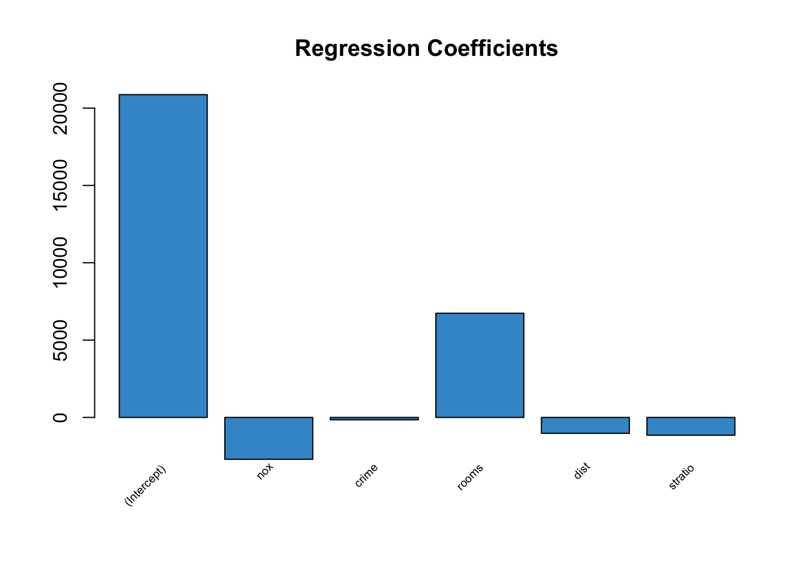
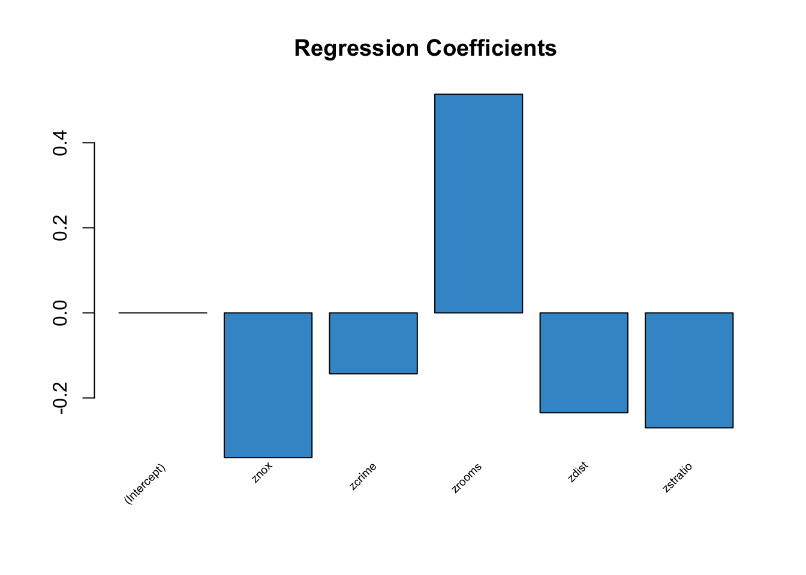
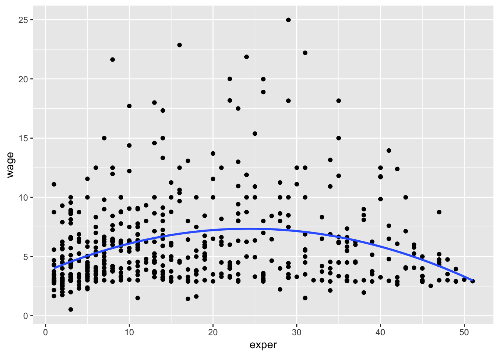
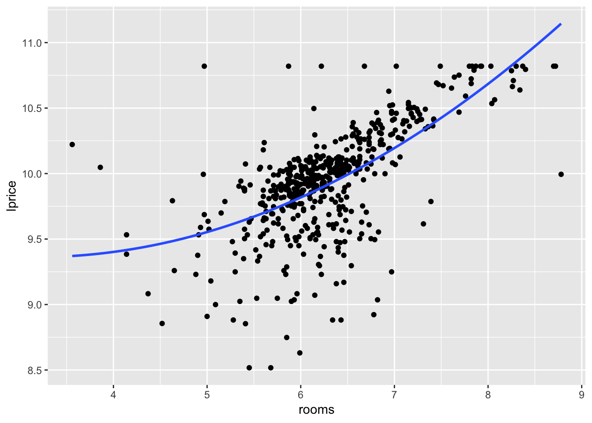

# Multiple Regression Analysis: Further Issues


## Effects of Data Scaling on OLS Statistics


```
## 
## Call:
## lm(formula = bwght ~ cigs + faminc, data = bwght)
## 
## Residuals:
##     Min      1Q  Median      3Q     Max 
## -96.061 -11.543   0.638  13.126 150.083 
## 
## Coefficients:
##              Estimate Std. Error t value Pr(>|t|)    
## (Intercept) 116.97413    1.04898 111.512  < 2e-16 ***
## cigs         -0.46341    0.09158  -5.060 4.75e-07 ***
## faminc        0.09276    0.02919   3.178  0.00151 ** 
## ---
## Signif. codes:  0 '***' 0.001 '**' 0.01 '*' 0.05 '.' 0.1 ' ' 1
## 
## Residual standard error: 20.06 on 1385 degrees of freedom
## Multiple R-squared:  0.0298,	Adjusted R-squared:  0.0284 
## F-statistic: 21.27 on 2 and 1385 DF,  p-value: 7.942e-10
```

```
## 
## Call:
## lm(formula = bwghtlbs ~ cigs + faminc, data = bwght)
## 
## Residuals:
##     Min      1Q  Median      3Q     Max 
## -6.0038 -0.7215  0.0399  0.8204  9.3802 
## 
## Coefficients:
##              Estimate Std. Error t value Pr(>|t|)    
## (Intercept)  7.310883   0.065562 111.512  < 2e-16 ***
## cigs        -0.028963   0.005724  -5.060 4.75e-07 ***
## faminc       0.005798   0.001824   3.178  0.00151 ** 
## ---
## Signif. codes:  0 '***' 0.001 '**' 0.01 '*' 0.05 '.' 0.1 ' ' 1
## 
## Residual standard error: 1.254 on 1385 degrees of freedom
## Multiple R-squared:  0.0298,	Adjusted R-squared:  0.0284 
## F-statistic: 21.27 on 2 and 1385 DF,  p-value: 7.942e-10
```

```
## 
## Call:
## lm(formula = bwght ~ packs + faminc, data = bwght)
## 
## Residuals:
##     Min      1Q  Median      3Q     Max 
## -96.061 -11.543   0.638  13.126 150.083 
## 
## Coefficients:
##              Estimate Std. Error t value Pr(>|t|)    
## (Intercept) 116.97413    1.04898 111.512  < 2e-16 ***
## packs        -9.26815    1.83154  -5.060 4.75e-07 ***
## faminc        0.09276    0.02919   3.178  0.00151 ** 
## ---
## Signif. codes:  0 '***' 0.001 '**' 0.01 '*' 0.05 '.' 0.1 ' ' 1
## 
## Residual standard error: 20.06 on 1385 degrees of freedom
## Multiple R-squared:  0.0298,	Adjusted R-squared:  0.0284 
## F-statistic: 21.27 on 2 and 1385 DF,  p-value: 7.942e-10
```

Once the effects are transformed into the same units, we get exactly the same answer, regardless of how the dependent variable is measured.

Changing the dependent variable from ounces to pounds has no effect on how statistically important the independent variables are.

The standard errors in model 2 are 16 times smaller than those in model 1 (t statistics are indeed identical).

SER in model 2 is 16 times smaller than that in model 1. 

In terms of goodness-of-fit, the R-squareds from the two regressions are identical.

## Example 1

We use the data from Example 4.5 (in the file HPRICE2) to illustrate the use of beta coefficients. Recall that the key independent variable is nox, a measure of the nitrogen oxide in the air over each community. One way to understand the size of the pollution effect—without getting into the science underlying nitrogen oxide’s effect on air quality—is to compute beta coefficients. (An alternative approach is contained in Example 4.5: we obtained a price elasticity with respect to nox by using price and nox in logarithmic form.)


```
## 
## Call:
## lm(formula = price ~ nox + crime + rooms + dist + stratio, data = hprice2)
## 
## Residuals:
##    Min     1Q Median     3Q    Max 
## -13914  -3201   -662   2110  38064 
## 
## Coefficients:
##             Estimate Std. Error t value Pr(>|t|)    
## (Intercept) 20871.13    5054.60   4.129 4.27e-05 ***
## nox         -2706.43     354.09  -7.643 1.09e-13 ***
## crime        -153.60      32.93  -4.665 3.97e-06 ***
## rooms        6735.50     393.60  17.112  < 2e-16 ***
## dist        -1026.81     188.11  -5.459 7.57e-08 ***
## stratio     -1149.20     127.43  -9.018  < 2e-16 ***
## ---
## Signif. codes:  0 '***' 0.001 '**' 0.01 '*' 0.05 '.' 0.1 ' ' 1
## 
## Residual standard error: 5586 on 500 degrees of freedom
## Multiple R-squared:  0.6357,	Adjusted R-squared:  0.632 
## F-statistic: 174.5 on 5 and 500 DF,  p-value: < 2.2e-16
```




```
## 
## Call:
## lm(formula = zprice ~ znox + zcrime + zrooms + zdist + zstratio, 
##     data = hprice2)
## 
## Residuals:
##     Min      1Q  Median      3Q     Max 
## -1.5110 -0.3476 -0.0719  0.2291  4.1334 
## 
## Coefficients:
##               Estimate Std. Error t value Pr(>|t|)    
## (Intercept)  5.679e-16  2.697e-02   0.000        1    
## znox        -3.404e-01  4.454e-02  -7.643 1.09e-13 ***
## zcrime      -1.433e-01  3.072e-02  -4.665 3.97e-06 ***
## zrooms       5.139e-01  3.003e-02  17.112  < 2e-16 ***
## zdist       -2.348e-01  4.302e-02  -5.459 7.57e-08 ***
## zstratio    -2.703e-01  2.997e-02  -9.018  < 2e-16 ***
## ---
## Signif. codes:  0 '***' 0.001 '**' 0.01 '*' 0.05 '.' 0.1 ' ' 1
## 
## Residual standard error: 0.6066 on 500 degrees of freedom
## Multiple R-squared:  0.6357,	Adjusted R-squared:  0.632 
## F-statistic: 174.5 on 5 and 500 DF,  p-value: < 2.2e-16
```



This equation shows that a one standard deviation increase in nox decreases price by .34 standard deviation; a one standard deviation increase in crime reduces price by .14 standard deviation. Thus, the same relative movement of pollution in the population has a larger effect on housing prices than crime does. Size of the house, as measured by number of rooms (rooms), has the largest standardized effect. If we want to know the effects of each independent variable on the dollar value of median house price, we should use the unstandardized variables.
Whether we use standardized or unstandardized variables does not affect statistical significance: the t statistics are the same in both cases.


```
## 
## Call:
## lm(formula = lprice ~ lnox + rooms, data = hprice2)
## 
## Residuals:
##      Min       1Q   Median       3Q      Max 
## -1.06485 -0.12331  0.00782  0.14471  1.38770 
## 
## Coefficients:
##             Estimate Std. Error t value Pr(>|t|)    
## (Intercept)  9.23374    0.18774   49.18   <2e-16 ***
## lnox        -0.71767    0.06634  -10.82   <2e-16 ***
## rooms        0.30592    0.01902   16.09   <2e-16 ***
## ---
## Signif. codes:  0 '***' 0.001 '**' 0.01 '*' 0.05 '.' 0.1 ' ' 1
## 
## Residual standard error: 0.286 on 503 degrees of freedom
## Multiple R-squared:  0.5137,	Adjusted R-squared:  0.5118 
## F-statistic: 265.7 on 2 and 503 DF,  p-value: < 2.2e-16
```
nox increases by 1%, price falls by .718%, holding only rooms fixed

rooms increases by one, price increases by approximately 100(.306) 5 30.6%
100[exp(.306) + 1] = 35.8%, which is  larger than the approximate percentage change

as the change in log(y) becomes larger and larger, the approximation becomes more and more inaccurate


```
## 
## Call:
## lm(formula = wage ~ exper + exper2, data = wage1)
## 
## Residuals:
##     Min      1Q  Median      3Q     Max 
## -5.5916 -2.1440 -0.8603  1.1801 17.7649 
## 
## Coefficients:
##               Estimate Std. Error t value Pr(>|t|)    
## (Intercept)  3.7254058  0.3459392  10.769  < 2e-16 ***
## exper        0.2981001  0.0409655   7.277 1.26e-12 ***
## exper2      -0.0061299  0.0009025  -6.792 3.02e-11 ***
## ---
## Signif. codes:  0 '***' 0.001 '**' 0.01 '*' 0.05 '.' 0.1 ' ' 1
## 
## Residual standard error: 3.524 on 523 degrees of freedom
## Multiple R-squared:  0.09277,	Adjusted R-squared:  0.0893 
## F-statistic: 26.74 on 2 and 523 DF,  p-value: 8.774e-12
```



## Example 2


```
## 
## Call:
## lm(formula = lprice ~ lnox + log(dist) + rooms + I(rooms^2) + 
##     stratio, data = hprice2)
## 
## Residuals:
##      Min       1Q   Median       3Q      Max 
## -1.04285 -0.12774  0.02038  0.12650  1.25272 
## 
## Coefficients:
##              Estimate Std. Error t value Pr(>|t|)    
## (Intercept) 13.385478   0.566473  23.630  < 2e-16 ***
## lnox        -0.901682   0.114687  -7.862 2.34e-14 ***
## log(dist)   -0.086781   0.043281  -2.005  0.04549 *  
## rooms       -0.545113   0.165454  -3.295  0.00106 ** 
## I(rooms^2)   0.062261   0.012805   4.862 1.56e-06 ***
## stratio     -0.047590   0.005854  -8.129 3.42e-15 ***
## ---
## Signif. codes:  0 '***' 0.001 '**' 0.01 '*' 0.05 '.' 0.1 ' ' 1
## 
## Residual standard error: 0.2592 on 500 degrees of freedom
## Multiple R-squared:  0.6028,	Adjusted R-squared:  0.5988 
## F-statistic: 151.8 on 5 and 500 DF,  p-value: < 2.2e-16
```




```
## 
## Call:
## lm(formula = lprice ~ lnox + I(lnox^2) + crime + rooms + I(rooms^2) + 
##     stratio, data = hprice2)
## 
## Residuals:
##      Min       1Q   Median       3Q      Max 
## -0.87229 -0.10976  0.00203  0.10383  1.22275 
## 
## Coefficients:
##              Estimate Std. Error t value Pr(>|t|)    
## (Intercept) 10.811804   0.893758  12.097  < 2e-16 ***
## lnox         2.438673   0.902243   2.703  0.00711 ** 
## I(lnox^2)   -0.844556   0.259702  -3.252  0.00122 ** 
## crime       -0.014247   0.001387 -10.273  < 2e-16 ***
## rooms       -0.783909   0.146791  -5.340 1.41e-07 ***
## I(rooms^2)   0.079962   0.011348   7.047 6.13e-12 ***
## stratio     -0.041385   0.005790  -7.147 3.16e-12 ***
## ---
## Signif. codes:  0 '***' 0.001 '**' 0.01 '*' 0.05 '.' 0.1 ' ' 1
## 
## Residual standard error: 0.2339 on 499 degrees of freedom
## Multiple R-squared:  0.6771,	Adjusted R-squared:  0.6732 
## F-statistic: 174.4 on 6 and 499 DF,  p-value: < 2.2e-16
```

## Example 3


```
## 
## Call:
## lm(formula = stndfnl ~ atndrte + priGPA + ACT + I(priGPA^2) + 
##     I(ACT^2) + I(atndrte * priGPA), data = attend)
## 
## Residuals:
##     Min      1Q  Median      3Q     Max 
## -3.1698 -0.5316 -0.0177  0.5737  2.3344 
## 
## Coefficients:
##                      Estimate Std. Error t value Pr(>|t|)    
## (Intercept)          2.050293   1.360319   1.507 0.132225    
## atndrte             -0.006713   0.010232  -0.656 0.512005    
## priGPA              -1.628540   0.481003  -3.386 0.000751 ***
## ACT                 -0.128039   0.098492  -1.300 0.194047    
## I(priGPA^2)          0.295905   0.101049   2.928 0.003523 ** 
## I(ACT^2)             0.004533   0.002176   2.083 0.037634 *  
## I(atndrte * priGPA)  0.005586   0.004317   1.294 0.196173    
## ---
## Signif. codes:  0 '***' 0.001 '**' 0.01 '*' 0.05 '.' 0.1 ' ' 1
## 
## Residual standard error: 0.8729 on 673 degrees of freedom
## Multiple R-squared:  0.2287,	Adjusted R-squared:  0.2218 
## F-statistic: 33.25 on 6 and 673 DF,  p-value: < 2.2e-16
```


```
## 
## Call:
## lm(formula = lsalary ~ years + gamesyr + bavg + hrunsyr, data = mlb1)
## 
## Residuals:
##     Min      1Q  Median      3Q     Max 
## -3.0642 -0.4614 -0.0271  0.4654  2.7216 
## 
## Coefficients:
##              Estimate Std. Error t value Pr(>|t|)    
## (Intercept) 11.020912   0.265719  41.476  < 2e-16 ***
## years        0.067732   0.012113   5.592 4.55e-08 ***
## gamesyr      0.015759   0.001564  10.079  < 2e-16 ***
## bavg         0.001419   0.001066   1.331    0.184    
## hrunsyr      0.035943   0.007241   4.964 1.08e-06 ***
## ---
## Signif. codes:  0 '***' 0.001 '**' 0.01 '*' 0.05 '.' 0.1 ' ' 1
## 
## Residual standard error: 0.7279 on 348 degrees of freedom
## Multiple R-squared:  0.6254,	Adjusted R-squared:  0.6211 
## F-statistic: 145.2 on 4 and 348 DF,  p-value: < 2.2e-16
```

```
## 
## Call:
## lm(formula = lsalary ~ years + gamesyr + bavg + rbisyr, data = mlb1)
## 
## Residuals:
##      Min       1Q   Median       3Q      Max 
## -2.97116 -0.45464 -0.05178  0.46468  2.67529 
## 
## Coefficients:
##              Estimate Std. Error t value Pr(>|t|)    
## (Intercept) 1.128e+01  2.737e-01  41.197  < 2e-16 ***
## years       6.973e-02  1.207e-02   5.776 1.70e-08 ***
## gamesyr     1.116e-02  2.145e-03   5.202 3.37e-07 ***
## bavg        7.398e-04  1.071e-03   0.691     0.49    
## rbisyr      1.652e-02  3.229e-03   5.117 5.13e-07 ***
## ---
## Signif. codes:  0 '***' 0.001 '**' 0.01 '*' 0.05 '.' 0.1 ' ' 1
## 
## Residual standard error: 0.7264 on 348 degrees of freedom
## Multiple R-squared:  0.6269,	Adjusted R-squared:  0.6226 
## F-statistic: 146.2 on 4 and 348 DF,  p-value: < 2.2e-16
```


```
## 
## Call:
## lm(formula = rdintens ~ lsales, data = rdchem)
## 
## Residuals:
##     Min      1Q  Median      3Q     Max 
## -1.9710 -1.4323 -0.5639  0.9874  5.7748 
## 
## Coefficients:
##             Estimate Std. Error t value Pr(>|t|)
## (Intercept)   1.1043     1.5782     0.7    0.490
## lsales        0.3017     0.2155     1.4    0.172
## 
## Residual standard error: 1.845 on 30 degrees of freedom
## Multiple R-squared:  0.06133,	Adjusted R-squared:  0.03004 
## F-statistic:  1.96 on 1 and 30 DF,  p-value: 0.1718
```

```
## 
## Call:
## lm(formula = rdintens ~ sales + I(sales^2), data = rdchem)
## 
## Residuals:
##     Min      1Q  Median      3Q     Max 
## -2.1418 -1.3630 -0.2257  1.0688  5.5808 
## 
## Coefficients:
##               Estimate Std. Error t value Pr(>|t|)    
## (Intercept)  2.613e+00  4.294e-01   6.084 1.27e-06 ***
## sales        3.006e-04  1.393e-04   2.158   0.0394 *  
## I(sales^2)  -6.946e-09  3.726e-09  -1.864   0.0725 .  
## ---
## Signif. codes:  0 '***' 0.001 '**' 0.01 '*' 0.05 '.' 0.1 ' ' 1
## 
## Residual standard error: 1.788 on 29 degrees of freedom
## Multiple R-squared:  0.1484,	Adjusted R-squared:  0.08969 
## F-statistic: 2.527 on 2 and 29 DF,  p-value: 0.09733
```

## Example 4


```
## 
## Call:
## lm(formula = salary ~ sales + roe, data = ceosal1)
## 
## Residuals:
##     Min      1Q  Median      3Q     Max 
## -1501.8  -492.6  -232.0   123.3 13575.2 
## 
## Coefficients:
##              Estimate Std. Error t value Pr(>|t|)    
## (Intercept) 8.306e+02  2.239e+02   3.710 0.000267 ***
## sales       1.634e-02  8.874e-03   1.842 0.066973 .  
## roe         1.963e+01  1.108e+01   1.772 0.077823 .  
## ---
## Signif. codes:  0 '***' 0.001 '**' 0.01 '*' 0.05 '.' 0.1 ' ' 1
## 
## Residual standard error: 1359 on 206 degrees of freedom
## Multiple R-squared:  0.02917,	Adjusted R-squared:  0.01975 
## F-statistic: 3.095 on 2 and 206 DF,  p-value: 0.04739
```

```
## 
## Call:
## lm(formula = lsalary ~ lsales + roe, data = ceosal1)
## 
## Residuals:
##     Min      1Q  Median      3Q     Max 
## -0.9464 -0.2888 -0.0322  0.2261  2.7830 
## 
## Coefficients:
##             Estimate Std. Error t value Pr(>|t|)    
## (Intercept) 4.362167   0.293878  14.843  < 2e-16 ***
## lsales      0.275087   0.033254   8.272 1.62e-14 ***
## roe         0.017872   0.003955   4.519 1.05e-05 ***
## ---
## Signif. codes:  0 '***' 0.001 '**' 0.01 '*' 0.05 '.' 0.1 ' ' 1
## 
## Residual standard error: 0.4822 on 206 degrees of freedom
## Multiple R-squared:  0.282,	Adjusted R-squared:  0.275 
## F-statistic: 40.45 on 2 and 206 DF,  p-value: 1.519e-15
```

## Example 5


```
## 
## Call:
## lm(formula = colgpa ~ sat + hsperc + hsize + hsizesq, data = gpa2)
## 
## Residuals:
##      Min       1Q   Median       3Q      Max 
## -2.57543 -0.35081  0.03342  0.39945  1.81683 
## 
## Coefficients:
##               Estimate Std. Error t value Pr(>|t|)    
## (Intercept)  1.493e+00  7.534e-02  19.812  < 2e-16 ***
## sat          1.492e-03  6.521e-05  22.886  < 2e-16 ***
## hsperc      -1.386e-02  5.610e-04 -24.698  < 2e-16 ***
## hsize       -6.088e-02  1.650e-02  -3.690 0.000228 ***
## hsizesq      5.460e-03  2.270e-03   2.406 0.016191 *  
## ---
## Signif. codes:  0 '***' 0.001 '**' 0.01 '*' 0.05 '.' 0.1 ' ' 1
## 
## Residual standard error: 0.5599 on 4132 degrees of freedom
## Multiple R-squared:  0.2781,	Adjusted R-squared:  0.2774 
## F-statistic:   398 on 4 and 4132 DF,  p-value: < 2.2e-16
```

```
## $fit
##        1 
## 2.700075 
## 
## $se.fit
## [1] 0.01987784
## 
## $df
## [1] 4132
## 
## $residual.scale
## [1] 0.5598638
```

```
## 
## Call:
## lm(formula = colgpa ~ sat0 + hsperc0 + hsize0 + hsizesq0, data = gpa2)
## 
## Residuals:
##      Min       1Q   Median       3Q      Max 
## -2.57543 -0.35081  0.03342  0.39945  1.81683 
## 
## Coefficients:
##               Estimate Std. Error t value Pr(>|t|)    
## (Intercept)  2.700e+00  1.988e-02 135.833  < 2e-16 ***
## sat0         1.492e-03  6.521e-05  22.886  < 2e-16 ***
## hsperc0     -1.386e-02  5.610e-04 -24.698  < 2e-16 ***
## hsize0      -6.088e-02  1.650e-02  -3.690 0.000228 ***
## hsizesq0     5.460e-03  2.270e-03   2.406 0.016191 *  
## ---
## Signif. codes:  0 '***' 0.001 '**' 0.01 '*' 0.05 '.' 0.1 ' ' 1
## 
## Residual standard error: 0.5599 on 4132 degrees of freedom
## Multiple R-squared:  0.2781,	Adjusted R-squared:  0.2774 
## F-statistic:   398 on 4 and 4132 DF,  p-value: < 2.2e-16
```

## Example 3


```
## 
## Call:
## lm(formula = lsalary ~ lsales + lmktval + ceoten, data = ceosal2)
## 
## Residuals:
##      Min       1Q   Median       3Q      Max 
## -2.49693 -0.29472  0.00964  0.30417  1.85286 
## 
## Coefficients:
##             Estimate Std. Error t value Pr(>|t|)    
## (Intercept) 4.503795   0.257234  17.509  < 2e-16 ***
## lsales      0.162854   0.039242   4.150 5.21e-05 ***
## lmktval     0.109243   0.049595   2.203   0.0289 *  
## ceoten      0.011705   0.005326   2.198   0.0293 *  
## ---
## Signif. codes:  0 '***' 0.001 '**' 0.01 '*' 0.05 '.' 0.1 ' ' 1
## 
## Residual standard error: 0.5048 on 173 degrees of freedom
## Multiple R-squared:  0.3182,	Adjusted R-squared:  0.3063 
## F-statistic: 26.91 on 3 and 173 DF,  p-value: 2.474e-14
```

```
##       1 
## 1112.18
```

## Explore 6.3

If we add the term $\beta_74 ACT * atndrte to equation (6.18), what is the partial effect of atndrte on stndfnl?


```
## 
## Call:
## lm(formula = stndfnl ~ atndrte + priGPA + ACT + I(priGPA^2) + 
##     I(ACT^2) + I(atndrte * priGPA) + I(ACT * atndrte), data = attend)
## 
## Residuals:
##      Min       1Q   Median       3Q      Max 
## -3.16053 -0.53800 -0.01647  0.56182  2.33417 
## 
## Coefficients:
##                       Estimate Std. Error t value Pr(>|t|)   
## (Intercept)          4.1697205  1.9086655   2.185  0.02926 * 
## atndrte             -0.0286160  0.0172147  -1.662  0.09692 . 
## priGPA              -1.5216291  0.4852014  -3.136  0.00179 **
## ACT                 -0.2435398  0.1225350  -1.988  0.04727 * 
## I(priGPA^2)          0.2784251  0.1015406   2.742  0.00627 **
## I(ACT^2)             0.0053608  0.0022361   2.397  0.01678 * 
## I(atndrte * priGPA)  0.0052925  0.0043166   1.226  0.22059   
## I(ACT * atndrte)     0.0009561  0.0006046   1.581  0.11430   
## ---
## Signif. codes:  0 '***' 0.001 '**' 0.01 '*' 0.05 '.' 0.1 ' ' 1
## 
## Residual standard error: 0.8719 on 672 degrees of freedom
## Multiple R-squared:  0.2315,	Adjusted R-squared:  0.2235 
## F-statistic: 28.92 on 7 and 672 DF,  p-value: < 2.2e-16
```

## Explore 6.5

How would you use residual analysis to deter- mine which professional athletes are overpaid or underpaid relative to their performance?
