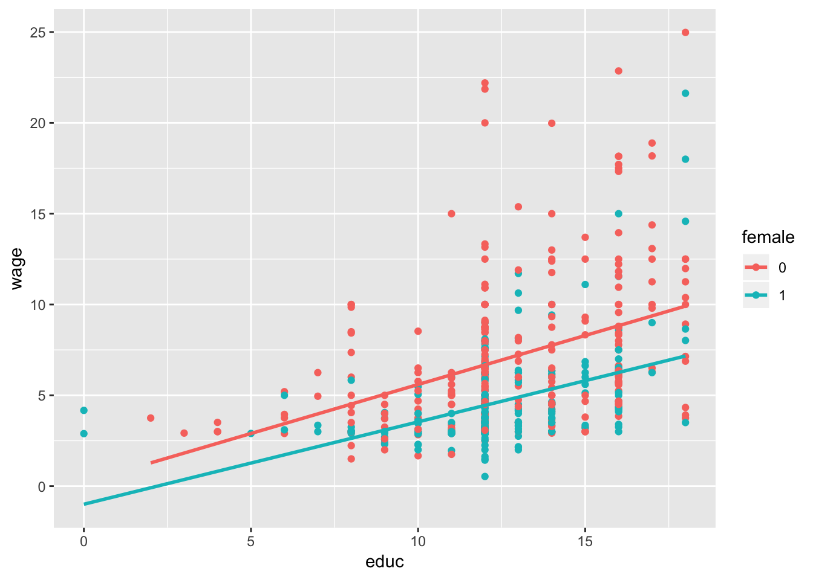

# Multiple Regression Analysis with Qualitative Information: Binary (or Dummy) Variables

Suppose that, in a study comparing election outcomes between Democratic and Republican candidates, you wish to indi- cate the party of each candidate. Is a name such as party a wise choice for a binary variable in this case? What would be a better name?

## Example 1


```
## 
## Call:
## lm(formula = wage ~ educ + female, data = wage1)
## 
## Residuals:
##     Min      1Q  Median      3Q     Max 
## -5.9890 -1.8702 -0.6651  1.0447 15.4998 
## 
## Coefficients:
##             Estimate Std. Error t value Pr(>|t|)    
## (Intercept)  0.62282    0.67253   0.926    0.355    
## educ         0.50645    0.05039  10.051  < 2e-16 ***
## female1     -2.27336    0.27904  -8.147 2.76e-15 ***
## ---
## Signif. codes:  0 '***' 0.001 '**' 0.01 '*' 0.05 '.' 0.1 ' ' 1
## 
## Residual standard error: 3.186 on 523 degrees of freedom
## Multiple R-squared:  0.2588,	Adjusted R-squared:  0.256 
## F-statistic: 91.32 on 2 and 523 DF,  p-value: < 2.2e-16
```




```
## 
## Call:
## lm(formula = wage ~ educ + female + exper + tenure, data = wage1)
## 
## Residuals:
##     Min      1Q  Median      3Q     Max 
## -7.7675 -1.8080 -0.4229  1.0467 14.0075 
## 
## Coefficients:
##             Estimate Std. Error t value Pr(>|t|)    
## (Intercept) -1.56794    0.72455  -2.164   0.0309 *  
## educ         0.57150    0.04934  11.584  < 2e-16 ***
## female1     -1.81085    0.26483  -6.838 2.26e-11 ***
## exper        0.02540    0.01157   2.195   0.0286 *  
## tenure       0.14101    0.02116   6.663 6.83e-11 ***
## ---
## Signif. codes:  0 '***' 0.001 '**' 0.01 '*' 0.05 '.' 0.1 ' ' 1
## 
## Residual standard error: 2.958 on 521 degrees of freedom
## Multiple R-squared:  0.3635,	Adjusted R-squared:  0.3587 
## F-statistic:  74.4 on 4 and 521 DF,  p-value: < 2.2e-16
```
The negative intercept—the intercept for men, in this case—is not very meaningful because no one has zero values for all of educ, exper, and tenure.

If we take a woman and a man with the same levels of education, experience, and tenure, the woman earns, on average, $1.81 less per hour than the man.


```
## 
## Call:
## lm(formula = wage ~ female, data = wage1)
## 
## Residuals:
##     Min      1Q  Median      3Q     Max 
## -5.5995 -1.8495 -0.9877  1.4260 17.8805 
## 
## Coefficients:
##             Estimate Std. Error t value Pr(>|t|)    
## (Intercept)   7.0995     0.2100  33.806  < 2e-16 ***
## female1      -2.5118     0.3034  -8.279 1.04e-15 ***
## ---
## Signif. codes:  0 '***' 0.001 '**' 0.01 '*' 0.05 '.' 0.1 ' ' 1
## 
## Residual standard error: 3.476 on 524 degrees of freedom
## Multiple R-squared:  0.1157,	Adjusted R-squared:  0.114 
## F-statistic: 68.54 on 1 and 524 DF,  p-value: 1.042e-15
```

men earn $7.10 per hour on average

average wage for women in the sample is 7.10 - 2.51 = 4.59, or $4.59 per hour

The estimated wage differential between men and women is larger in model 2 than in model 1 because model 2 does not control for differences in education, experience, and tenure, and these are lower, on average, for women than for men 

## Example 2


```
## 
## Call:
## lm(formula = colGPA ~ PC + hsGPA + ACT, data = gpa1)
## 
## Residuals:
##     Min      1Q  Median      3Q     Max 
## -0.7901 -0.2622 -0.0107  0.2334  0.7570 
## 
## Coefficients:
##             Estimate Std. Error t value Pr(>|t|)    
## (Intercept) 1.263520   0.333125   3.793 0.000223 ***
## PC1         0.157309   0.057287   2.746 0.006844 ** 
## hsGPA       0.447242   0.093647   4.776 4.54e-06 ***
## ACT         0.008659   0.010534   0.822 0.412513    
## ---
## Signif. codes:  0 '***' 0.001 '**' 0.01 '*' 0.05 '.' 0.1 ' ' 1
## 
## Residual standard error: 0.3325 on 137 degrees of freedom
## Multiple R-squared:  0.2194,	Adjusted R-squared:  0.2023 
## F-statistic: 12.83 on 3 and 137 DF,  p-value: 1.932e-07
```

```
## 
## Call:
## lm(formula = colGPA ~ PC, data = gpa1)
## 
## Residuals:
##      Min       1Q   Median       3Q      Max 
## -0.95893 -0.25893  0.01059  0.31059  0.84107 
## 
## Coefficients:
##             Estimate Std. Error t value Pr(>|t|)    
## (Intercept)  2.98941    0.03950  75.678   <2e-16 ***
## PC1          0.16952    0.06268   2.704   0.0077 ** 
## ---
## Signif. codes:  0 '***' 0.001 '**' 0.01 '*' 0.05 '.' 0.1 ' ' 1
## 
## Residual standard error: 0.3642 on 139 degrees of freedom
## Multiple R-squared:  0.04999,	Adjusted R-squared:  0.04315 
## F-statistic: 7.314 on 1 and 139 DF,  p-value: 0.007697
```

student who owns a PC has a predicted GPA about .16 points higher than a comparable student without a PC

Regressing colGPA on PC gives an estimate on PC equal to about .17. 

## Example 3


```
## 
## Call:
## lm(formula = hrsemp ~ grant + lsales + lemploy, data = jtrain %>% 
##     filter(year == 1988))
## 
## Residuals:
##     Min      1Q  Median      3Q     Max 
## -36.874 -13.128  -3.642   4.770 119.618 
## 
## Coefficients:
##             Estimate Std. Error t value Pr(>|t|)    
## (Intercept)  46.6651    43.4121   1.075    0.285    
## grant        26.2545     5.5918   4.695  8.4e-06 ***
## lsales       -0.9846     3.5399  -0.278    0.781    
## lemploy      -6.0699     3.8829  -1.563    0.121    
## ---
## Signif. codes:  0 '***' 0.001 '**' 0.01 '*' 0.05 '.' 0.1 ' ' 1
## 
## Residual standard error: 24.38 on 101 degrees of freedom
##   (52 observations deleted due to missingness)
## Multiple R-squared:  0.2368,	Adjusted R-squared:  0.2141 
## F-statistic: 10.44 on 3 and 101 DF,  p-value: 4.804e-06
```
cannot enter hrsemp in logarithmic form because hrsemp is zero for 29 

grant is very statistically significant

coefficient on log(sales) is small and very insignificant

coefficient on log(employ) means that, if a firm is 10% larger, it trains its workers about .61 hour less. Its t statistic is 21.56, which is only marginally statistically significan


```
## 
## Call:
## lm(formula = lprice ~ llotsize + lsqrft + bdrms + colonial, data = hprice1)
## 
## Residuals:
##      Min       1Q   Median       3Q      Max 
## -0.69479 -0.09750 -0.01619  0.09151  0.70228 
## 
## Coefficients:
##             Estimate Std. Error t value Pr(>|t|)    
## (Intercept) -1.34959    0.65104  -2.073   0.0413 *  
## llotsize     0.16782    0.03818   4.395 3.25e-05 ***
## lsqrft       0.70719    0.09280   7.620 3.69e-11 ***
## bdrms        0.02683    0.02872   0.934   0.3530    
## colonial1    0.05380    0.04477   1.202   0.2330    
## ---
## Signif. codes:  0 '***' 0.001 '**' 0.01 '*' 0.05 '.' 0.1 ' ' 1
## 
## Residual standard error: 0.1841 on 83 degrees of freedom
## Multiple R-squared:  0.6491,	Adjusted R-squared:  0.6322 
## F-statistic: 38.38 on 4 and 83 DF,  p-value: < 2.2e-16
```

the difference in log(price) between a house of colonial style and that of another style is .054

a colonial-style house is predicted to sell for about 5.4% more, holding other factors fixed

when log(y) is the dependent variable in a model, the co- efficient on a dummy variable, when multiplied by 100, is interpreted as the percentage difference in y, holding all other factors fixed.


```
## 
## Call:
## lm(formula = lwage ~ educ + female + exper + expersq + tenure + 
##     tenursq, data = wage1)
## 
## Residuals:
##      Min       1Q   Median       3Q      Max 
## -1.83160 -0.25658 -0.02126  0.25500  1.13370 
## 
## Coefficients:
##               Estimate Std. Error t value Pr(>|t|)    
## (Intercept)  0.4166910  0.0989279   4.212 2.98e-05 ***
## educ         0.0801967  0.0067573  11.868  < 2e-16 ***
## female1     -0.2965110  0.0358055  -8.281 1.04e-15 ***
## exper        0.0294324  0.0049752   5.916 6.00e-09 ***
## expersq     -0.0005827  0.0001073  -5.431 8.65e-08 ***
## tenure       0.0317139  0.0068452   4.633 4.56e-06 ***
## tenursq     -0.0005852  0.0002347  -2.493    0.013 *  
## ---
## Signif. codes:  0 '***' 0.001 '**' 0.01 '*' 0.05 '.' 0.1 ' ' 1
## 
## Residual standard error: 0.3998 on 519 degrees of freedom
## Multiple R-squared:  0.4408,	Adjusted R-squared:  0.4343 
## F-statistic: 68.18 on 6 and 519 DF,  p-value: < 2.2e-16
```
the coefficient on female implies that, for the same levels of educ, exper, and tenure, women earn about 100(.297) = 29.7% less than men

exact percentage difference in predicted wages


the difference in predicted wages between men and women is about 29.7%


